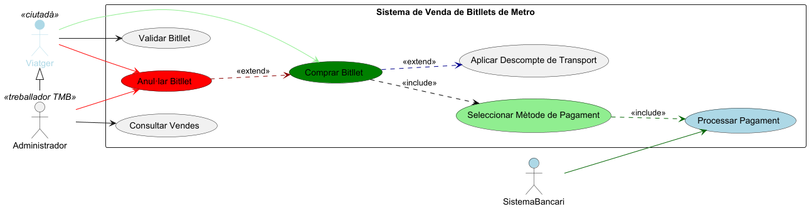
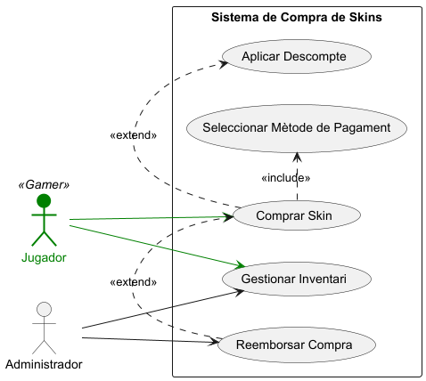
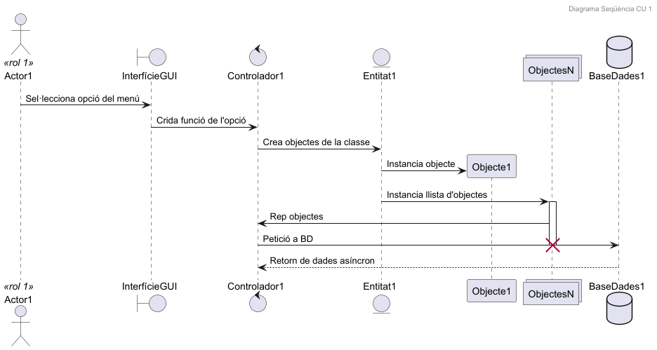
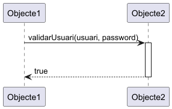
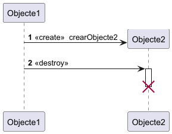
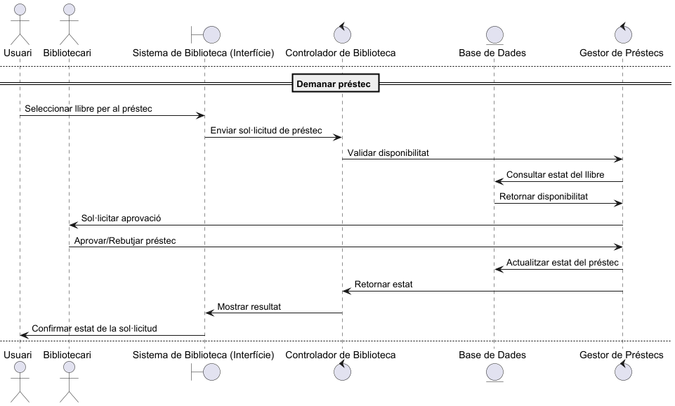
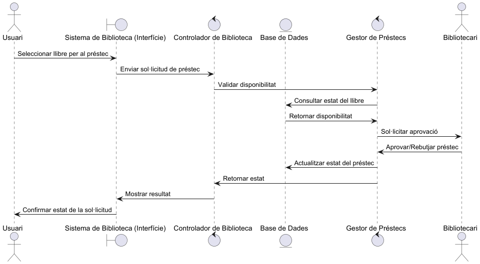

# 📘 Sistema de Disseny de Sistemes (UML)

Aquest projecte conté diversos diagrames UML generats amb PlantUML per representar casos d'ús i seqüències de diferents sistemes, com ara una biblioteca, un sistema de metro i un sistema de compra de skins. Cada secció inclou el codi UML, una breu explicació i una imatge de resultat (que has de generar amb PlantUML).

---

## 🟩 Cas d'ús: Sistema de Venda de Bitllets de Metro

Aquest diagrama mostra com un viatger pot comprar i validar bitllets, aplicar descomptes i fer pagaments a través del sistema de venda.

### 📄 Codi UML
```plantuml
@startuml
left to right direction

actor Viatger << ciutadà >> #lightblue;line:lightblue;text:lightblue
actor Administrador << treballador TMB>>
actor SistemaBancari #lightblue

Administrador -left-|> Viatger

rectangle "Sistema de Venda de Bitllets de Metro" {
    usecase "Comprar Bitllet" as UC1 #green
    usecase "Seleccionar Mètode de Pagament" as UC2 #lightgreen
    usecase "Processar Pagament" as UC3 #lightblue
    usecase "Aplicar Descompte de Transport" as UC4
    usecase "Validar Bitllet" as UC5
    usecase "Anul·lar Bitllet" as UC6 #red
    usecase "Consultar Vendes" as UC7
}

Viatger -[#lightgreen]-> UC1
Viatger --> UC5
Viatger -[#red]-> UC6

Administrador -[#red]-> UC6
Administrador --> UC7

UC1 .[#black].> UC2 : <<include>>
UC2 .[#darkgreen].> UC3 : <<include>>
UC1 .[#darkblue].> UC4 : <<extend>>
UC6 .[#darkred].> UC1 : <<extend>>

SistemaBancari -[#darkgreen]-> UC3
@enduml
````



```plantuml
@startuml
left to right direction

:Jugador: << Gamer >> as J #green;line:green;line.bold;text:green
actor Administrador as A

rectangle "Sistema de Compra de Skins" {
(Comprar Skin) as UC1
usecase "Seleccionar Mètode de Pagament" as UC2
usecase "Aplicar Descompte" as UC3
usecase "Gestionar Inventari" as UC4
usecase "Reemborsar Compra" as UC5
}

J --> UC1 #green
J --> UC4 #green
A --> UC4
A --> UC5

UC1 .> UC2 : <<include>>
UC1 .> UC3 : <<extend>>
UC5 .> UC1 : <<extend>>
@enduml
````


```plantuml
@startuml
header Diagrama Seqüència CU 1

actor Actor1 <<rol 1>>
boundary InterfícieGUI
control Controlador1
entity Entitat1

Actor1 -> InterfícieGUI : Sel·lecciona opció del menú
InterfícieGUI -> Controlador1 : Crida funció de l'opció
Controlador1 -> Entitat1 : Crea objectes de la classe
create participant Objecte1
Entitat1 -> Objecte1 : Instancia objecte
collections ObjectesN
database BaseDades1
Entitat1 -> ObjectesN : Instancia llista d'objectes
activate ObjectesN
ObjectesN -> Controlador1 : Rep objectes
Controlador1 -> BaseDades1 : Petició a BD
deactivate ObjectesN
destroy ObjectesN
BaseDades1 --> Controlador1 : Retorn de dades asíncron
@enduml
````


```plantuml
@startuml
participant Objecte1 as o1
participant Objecte2 as o2

o1 -> o2 : validarUsuari(usuari, password)
activate o2
|||
o2 --> o1 : true
deactivate o2
@enduml
````


```plantuml
@startuml
participant Objecte1 as o1
autonumber

create Objecte2 as o2
o1 -> o2 : << create >>  crearObjecte2
o1 -> o2 : << destroy >>
activate o2
|||
deactivate o2
destroy o2
@enduml

````


```plantuml
== Demanar préstec ==
actor Usuari
boundary "Sistema de Biblioteca (Interfície)" as UI
control "Controlador de Biblioteca" as Control
entity "Base de Dades" as DB
control "Gestor de Préstecs" as Gestor
actor Bibliotecari

Usuari -> UI: Seleccionar llibre per al préstec
UI -> Control: Enviar sol·licitud de préstec
Control -> Gestor: Validar disponibilitat
Gestor -> DB: Consultar estat del llibre
DB -> Gestor: Retornar disponibilitat
Gestor -> Bibliotecari: Sol·licitar aprovació
Bibliotecari -> Gestor: Aprovar/Rebutjar préstec
Gestor -> DB: Actualitzar estat del préstec
Gestor -> Control: Retornar estat
Control -> UI: Mostrar resultat
UI -> Usuari: Confirmar estat de la sol·licitud
````


```plantuml
@startuml
header CU Demanar préstec

actor Usuari
boundary "Sistema de Biblioteca (Interfície)" as UI
control "Controlador de Biblioteca" as Control
entity "Base de Dades" as DB
control "Gestor de Préstecs" as Gestor
actor Bibliotecari

Usuari -> UI: Seleccionar llibre per al préstec
UI -> Control: Enviar sol·licitud de préstec
Control -> Gestor: Validar disponibilitat
Gestor -> DB: Consultar estat del llibre
DB --> Gestor: Retornar disponibilitat
Gestor -> Bibliotecari: Sol·licitar aprovació
Bibliotecari -> Gestor: Aprovar/Rebutjar préstec
Gestor -> DB: Actualitzar estat del préstec
Gestor -> Control: Retornar estat
Control -> UI: Mostrar resultat
UI -> Usuari: Confirmar estat de la sol·licitud
@enduml
````

